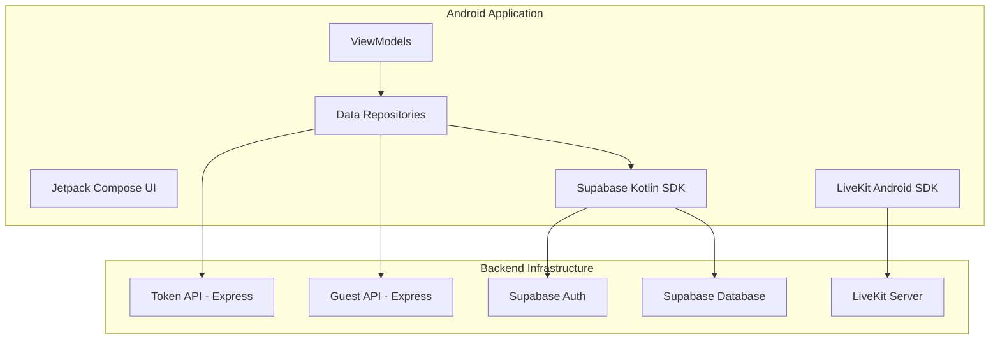

# LeTsMeet Android Architecture Map

This document maps the Android client capabilities to the existing LeTsMeet backend infrastructure.

## System Overview



## Backend Contracts

### 1. Authentication (Supabase)
- **Provider**: Supabase Auth
- **Android Client**: `io.github.jan-tennert.supabase:gotrue-kt`
- **Flow**: Standard Email/Password login. Persistent session managed by the SDK.

### 2. Meetings Database (Supabase)
- **Table**: `meetings`
    - `id`: UUID (Primary Key)
    - `code`: String (Unique, e.g., "abc-defg-hij")
    - `title`: String
    - `status`: 'scheduled' | 'active' | 'past'
- **Table**: `meeting_participants`
    - `meeting_id`: UUID
    - `user_id`: UUID
    - `role`: 'host' | 'participant'
- **RPCs**:
    - `join_meeting(meeting_code)`: Existing logic to handle participation.

### 3. LiveKit Token API
- **Endpoint**: `GET /api/livekit/token?room=<room_code>`
- **Authentication**: `Authorization: Bearer <supabase_access_token>`
- **Response**:
  ```json
  {
    "token": "JWT_TOKEN",
    "room": "room_code",
    "identity": "user_id",
    "name": "User Name"
  }
  ```

### 4. Guest Access API
- **Endpoint**: `POST /api/guest/session`
- **Request**:
  ```json
  {
    "meetingCode": "abc-defg-hij",
    "displayName": "Guest Name"
  }
  ```
- **Response**: Returns a temporary Supabase session/token for the guest.

## Feature Mapping

| Android Feature | Backend Mapping | Status |
| :--- | :--- | :--- |
| **Login/Logout** | Supabase Auth SDK | Ready |
| **Meeting List** | `meetings` table via Supabase Postgrest | Ready |
| **Create Meeting** | `meetings` table insert | Ready |
| **Meeting Details** | `meetings` join `meeting_participants` | Ready |
| **Join Meeting Room**| LiveKit SDK + Token API | Ready |
| **Camera/Mic Toggle**| LiveKit LocalTrack management | Ready |
| **Remote Participants**| LiveKit Room events | Ready |
| **App Links** | `/join/<code-code>` | Planning |

## Security Model
- **AUTHORITATIVE**: Backend (Supabase RLS + Token API) determines all permissions.
- **GUESTS**: Restricted via RLS and specific Guest API limits.
- **SECRETS**: No service-role keys or secrets in the APK. Only Anon Key and URL.
