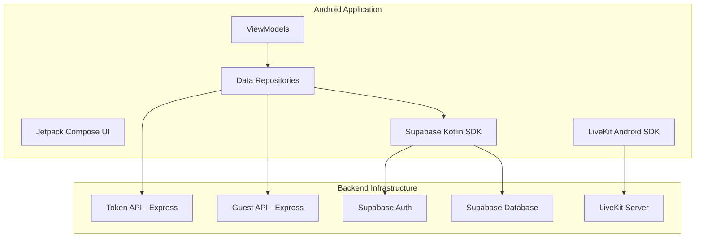

# LeTsMeet Android Architecture Map

This document maps the Android client capabilities to the LeTsMeet backend infrastructure.

## System Overview

## Backend Contracts

### 1. Authentication (Supabase)
- **Provider**: Supabase Auth
- **Android Client**: `io.github.jan.supabase:auth-kt`
- **Flow**: Email/Password login. Sessions are persisted and restored on launch.

### 2. Meetings Database (Supabase)
- **RPCs**:
    - `create_persistent_meeting(p_title)`: Authored meeting creation.
    - `lookup_joinable_meeting(p_code)`: Secure meeting lookup.
    - `join_persistent_meeting(p_code)`: Registers participation.

### 3. LiveKit Token API
- **Endpoint**: `GET /api/livekit/token?room=<room_code>`
- **Authentication**: `Authorization: Bearer <supabase_access_token>`
- **Behavior**: Returns a JWT for LiveKit room access.

### 4. Guest Access API
- **Endpoint**: `POST /api/guest/session`
- **Request**: `{ "room": "normalizedCode", "displayName": "Guest Name" }`
- **Response**: Returns a temporary Supabase session for guest access.

## Status

| Feature | Implementation | Build Verified | Lint Verified | Runtime Verified |
| :--- | :--- | :--- | :--- | :--- |
| **Login/Logout** | IMPLEMENTED | PASS | PASS | BLOCKED (ENV) |
| **Session Persistence** | IMPLEMENTED | PASS | PASS | BLOCKED (ENV) |
| **Meeting List** | IMPLEMENTED | PASS | PASS | BLOCKED (ENV) |
| **Create Meeting** | IMPLEMENTED (RPC) | PASS | PASS | BLOCKED (ENV) |
| **Join Meeting Room**| IMPLEMENTED (SDK) | PASS | PASS | BLOCKED (ENV) |
| **LiveKit Video** | IMPLEMENTED (Grid) | PASS | PASS | BLOCKED (ENV) |
| **Audio/Video Toggles**| IMPLEMENTED | PASS | PASS | BLOCKED (ENV) |
| **Guest Join Flow** | IMPLEMENTED | PASS | PASS | BLOCKED (ENV) |
| **Deep Linking** | IMPLEMENTED | PASS | PASS | BLOCKED (ENV) |
| **Collaboration** | Chat/React/Hand | PASS | PASS | BLOCKED (ENV) |

## Security Summary
- **Zero Secrets**: No service-role keys or API secrets are embedded in the APK.
- **Authoritative Backend**: All database operations and LiveKit tokens are secured via RLS and backend logic.
- **Tenant Isolation**: RPCs enforce organization/workspace context.

## Remaining Blockers
- **App Link Verification**: Requires `assetlinks.json` deployment on `letsmeet.futurestands.com`.
- **Runtime Validation**: Physical device or emulator with camera/mic drivers is required to verify real-time media flows.
- **Interoperability Confirmation**: Web <-> Android media validation is pending real device availability.
